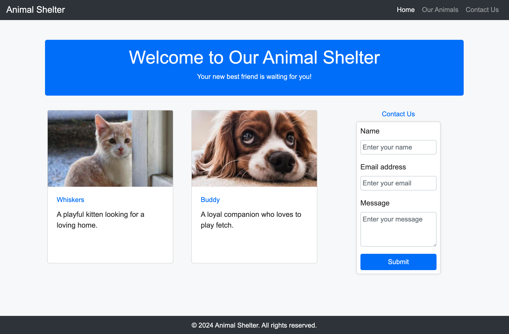

# Putting it all Together 

##

## Description 📄
In this assignment, you will work solo with the help of AI to build an animal shelter webpage using 100% Bootstrap to style it. You'll create a navbar, animal cards, contact form and a footer. Use AI to assist with coding, design choices, and troubleshooting as you develop a responsive and accessible webpage with Bootstrap's built-in components.

## Expected Project Structure 🏗️

```plaintext

animalShelter/
│
├── index.html

```
# Instructions ✅

## 1. **Create the Project Folder and Files**
   - [ ] Create a folder named `animalShelter` to store all your project files.
   
   - [ ] Inside the `animalShelter`` folder, create a file named `index.html`. This will be your main HTML file.
   


## 2. **Start with an HTML Boilerplate**
Now that your files are set up, begin by adding the basic HTML boilerplate.


  - [ ] Ask AI to help you prepare an HTML boilerplate without a `styles.css` link. Copy and paste that code into your `index.html` file.


*The boilerplate code should look something like this:*
```html
<!DOCTYPE html>
<html lang="en">
<head>
  <meta charset="UTF-8">
  <meta name="viewport"
       content="width=device-width, initial-scale=1.0">
  <title>Animal Shelter</title>

  <!-- Bootstrap CDN Goes Here -->

</head>
<body>
<!-- Web page code goes here -->
</body>
</html>
```

**Explanation:**
- Declares the document as HTML5 and sets up the essential metadata and styles.

## 3. **Access Bootstrap Styling**
Now we will add a CDN link to include Bootstrap for styling our web page.


- [ ] Copy and paste the link below into the `<head>` of your HTML boilerplate, right after the title.

```html

<link href="https://cdn.jsdelivr.net/npm/bootstrap@5.3.3/dist/css/bootstrap.min.css" 
rel="stylesheet" 
integrity="sha384-QWTKZyjpPEjISv5WaRU9OFeRpok6YctnYmDr5pNlyT2bRjXh0JMhjY6hW+ALEwIH" 
crossorigin="anonymous">

```

**Explanation:**
- By adding the CDN link, we included Bootstrap's CSS to style our web page with its predefined classes and components.

## 3. **Adding Styles to the Body**
The objective is to adjust the <body> tag to apply a light background and dark text across the entire page using Bootstrap classes.


- [ ] Ask AI: ""What changes should I make to the `<body>` tag to apply a light background with dark text to the entire page?"
- [ ] Replace the supplied code inside the `index.hytml` file.

**Explanation:**
- We applied Bootstrap classes to the `<body>` tag to ensure the entire page has a light background and dark text, creating a clean and readable layout.

## 4. **Building out the NavBar**
Let's create a responsive Bootstrap navbar with a brand on the left and navigation links on the right, all styled with a dark theme.


- [ ] Ask AI: "With the Bootstrap CDN link already in place, how do I create a responsive navbar that expands on large screens. 
- [ ] Ask AI: "How do I add the 'Animal Shelter' branding text on the left side of the navbar?" 
- [ ] Ask AI: "How do I add the navigation links 'Home,' 'Our Animals,' and 'Contact Us' to the right side of the navbar?"
- [ ] Ask AI: "With the CDN link already in place, how do I style the navbar with a dark background and light text using Bootstrap?"
- [ ] Ask AI: "How do I wrap the entire navbar content inside a fluid container with padding on the left and right for consistent spacing?"
- [ ] Place the supplied navbar code inside the `<body>` tags of your HTML file.
- [ ] Open the `index.html` file in your browser to see the results.
- [ ] Ask AI for help if you need to tweak or adjust anything in the navbar.


**Explanation:**
- We created a responsive Bootstrap navbar styled with a dark theme and placed it inside the `<body>` of the HTML document.

## 5. **Building out the Main Section**
We are building the main content section of the webpage, focusing on creating a visually appealing and responsive layout using Bootstrap.


- [ ] Ask AI: "How do I create a main content container that includes a centered heading followed by a row with two cards and a form using Bootstrap?"
- [ ] Ask AI: "How do I add the centered heading, 'Welcome to Our Animal Shelter,' using Bootstrap?"
- [ ] Ask AI: "How do I add a subheading, 'Your new best friend is waiting for you!' centered below the main heading in a Bootstrap column?"
- [ ] Ask AI: "How do I style the main heading and subheading section with a blue background, white text, and rounded corners using Bootstrap classes?"
- [ ] Place the supplied code inside the `<body>` tags after the `nav` code of your HTML file.
- [ ] Open the `index.html` file in your browser to see the results.
- [ ] Ask AI for help if you need to tweak or adjust anything in the navbar.


**Explanation:**
- We structured the main contentsection with a centered heading and subheading on a blue background. 

## 6. **Animal Cards and Contact Form Grid **
Now we are building a responsive layout that displays two animal cards and a contact form side by side within a Bootstrap grid.


- [ ] Ask AI: "How do I create a Bootstrap grid row that will hold three equal columns after the main section?"
- [ ] Ask AI: "How do I add an animal card to the first column, with an image, title 'Whiskers,' and description, using the image link 'https://placekitten.com/400/300'?"
- [ ] Ask AI: "How do I add an animal card to the second column, with an image, title 'Buddy,' and description, using image link 'https://placedog.net/400/300'?"
- [ ] Ask AI: "How do I create a contact form in the third column of the row, including fields for 'Name,' 'Email address,' and 'Message,' all styled with Bootstrap?"
- [ ] Ask AI: "How do I ensure the two animal cards and the contact form are aligned in a single row of three columns using Bootstrap’s grid system?"
- [ ] Place the supplied code inside the `<body>` tags after the `<main>` section code of your HTML file.
- [ ] Open the `index.html` file in your browser to see the results.
- [ ] Ask AI for help if you need to tweak or adjust anything in the navbar.


**Explanation:**
- We are guiding AI to create a Bootstrap grid row with three equal columns after the main section ensuring they are aligned in a single row, all styled and positioned correctly.

## 7. **The Footer**
We will now add a footer section to the webpage, providing consistent styling and information at the bottom of the page using Bootstrap.


- [ ] Ask AI: "How do I create a full-width footer using Bootstrap?"
- [ ] Ask AI: "How do I ensure the footer stays at the bottom of the page with following text '© 2024 Animal Shelter. All rights reserved.' centered?"
- [ ] Ask AI: "How do I style the footer with a dark background, white text, and padding using Bootstrap?"
- [ ] Place the supplied footer code inside the <body> tags, at the bottom of your HTML file, before the closing `</body>` tag. 
- [ ] Open the `index.html` file in your browser to see the results.
- [ ] Ask AI for help if you need to tweak or adjust anything in the navbar.


**Explanation:**
- We are adding a full-width footer to the webpage, ensuring it's centered at the bottom with consistent styling using Bootstrap.


# Conclusion 📄
In this project, you built a complete webpage for an animal shelter using Bootstrap. 
Through this process, you learned how to use Bootstrap's grid system, components, and utility classes to create a visually appealing and responsive layout.
You should now have a solid understanding of how to structure and style a webpage using Bootstrap.

##

### Solution codebase 👀
🛑 **Only use this as a reference** 🛑

💾 **Not something to copy and paste** 💾

**Note:**  This lab references a solution file located [here](https://github.com/HackerUSA-CE/aisd-wde-8-putting-it-all-together/tree/solution) (link not shown).


---
© All rights reserved to ThriveDX


